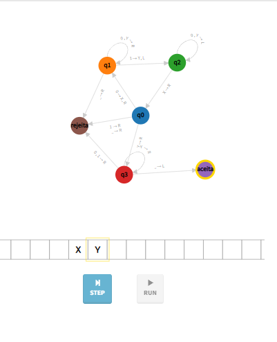
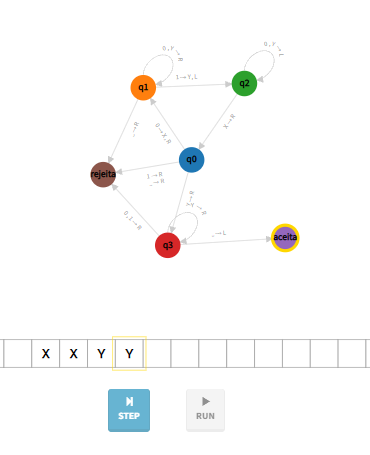
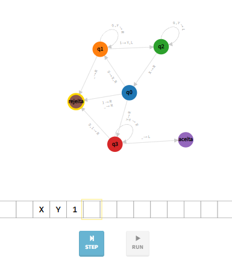
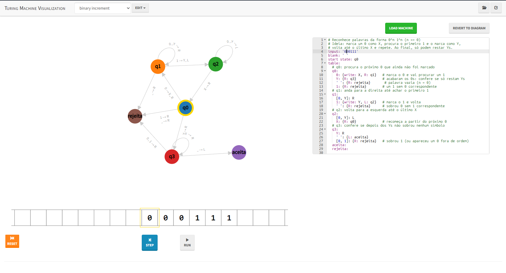
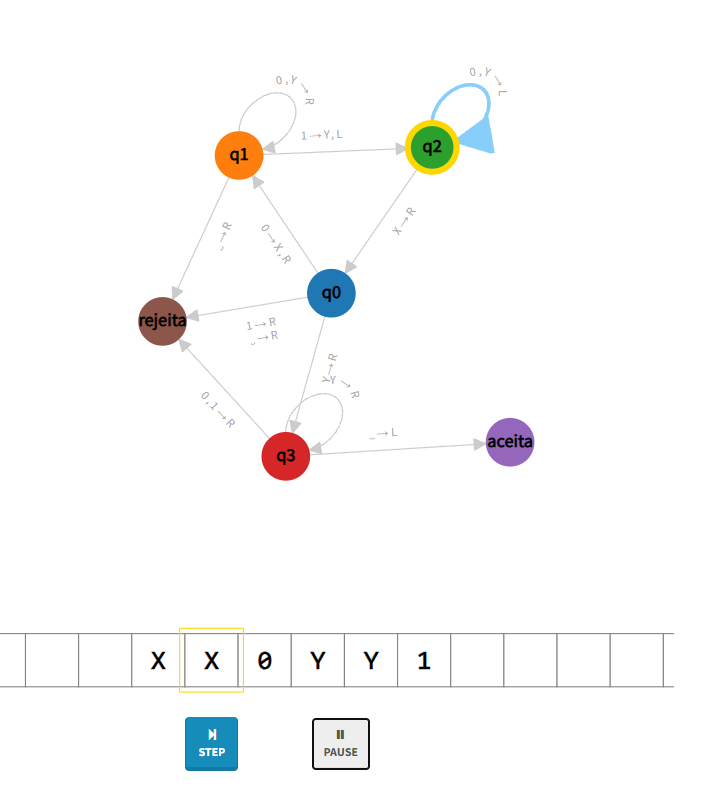
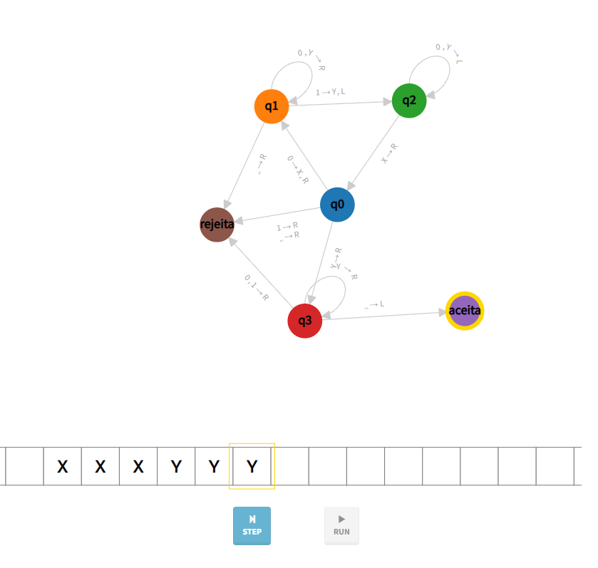

# Máquinas de Turing

**Curso:** Ciência da Computação\
**Disciplina:** Linguagens Formais e Autômatos

<!-- readme-only -->
**[Baixar o trabalho em PDF](<Máquinas de Turing.pdf>)**
<!-- /readme-only -->

---

## Etapa 1 — Introdução

> Após assistir ao vídeo e estudar o material disponibilizado, responda às questões abaixo.

### 1. O que é uma Máquina de Turing?

Uma Máquina de Turing é um modelo matemático que define formalmente o conceito de computação.

### 2. Quais são os principais componentes de uma Máquina de Turing?

- **Fita infinita:** dividida em células, onde cada uma armazena um símbolo;
- **Cabeça de leitura/escrita:** lê e escreve símbolos na fita, movendo-se para a esquerda ou para a direita;
- **Tabela de transições:** conjunto de regras que, a partir do estado atual e do símbolo lido, determina o símbolo a ser escrito, o movimento da cabeça e o próximo estado.

### 3. Qual é a importância das Máquinas de Turing para a computação?

A Máquina de Turing define o que é computação. Ela é a base lógica sobre a qual todo o paradigma da Ciência da Computação e a arquitetura de hardware atual foram construídos.

### 4. Qual é a relação entre Máquina de Turing e algoritmo?

Se um problema pode ser resolvido por um algoritmo, então, em teoria, ele também pode ser resolvido por uma Máquina de Turing Universal. Turing estabeleceu regras para transformar processos manuais em processos automáticos e previsíveis, o que constitui a essência de um algoritmo moderno.

---

## Etapa 2 — Simulação

> Utilize um software ou simulador de Máquina de Turing indicado pelo professor.
> Crie uma máquina capaz de reconhecer palavras da forma **0ⁿ1ⁿ**.

**Simulador utilizado:** [Turing Machine Visualization](https://turingmachine.io/)

### Estratégia

A Máquina de Turing não possui variáveis nem contadores: toda a "memória" fica registrada na própria fita. Por isso, a máquina forma **pares** entre um `0` e um `1`, marcando cada símbolo já contado:

- cada `0` pareado é substituído por `X`;
- cada `1` pareado é substituído por `Y`.

A cada rodada, a máquina marca o primeiro `0` ainda não pareado, avança até o primeiro `1` livre, marca-o e retorna para o início da parte não processada. Quando não houver mais `0`s, ela verifica se restam apenas `Y`s até o fim da fita. Símbolos diferentes (`X` e `Y`) são usados para que a máquina saiba identificar onde termina a parte já processada de cada bloco.

```text
0 0 0 1 1 1    início
X 0 0 Y 1 1    1º par marcado
X X 0 Y Y 1    2º par marcado
X X X Y Y Y    3º par marcado → aceita
```

### Estados

| Estado    | Função                                                                 |
|-----------|------------------------------------------------------------------------|
| `q0`      | Estado inicial. Procura o próximo `0` não marcado.                     |
| `q1`      | Avança para a direita até encontrar o primeiro `1` não marcado.        |
| `q2`      | Retorna para a esquerda até encontrar o último `X`.                    |
| `q3`      | Verifica se, após os `0`s acabarem, restam apenas `Y`s na fita.        |
| `aceita`  | Estado final de aceitação.                                             |
| `rejeita` | Estado final de rejeição.                                              |

### Código da máquina (turingmachine.io)

```yaml
# Reconhece palavras da forma 0^n 1^n (n >= 1)
# Ideia: marca um 0 como X, procura o primeiro 1 e o marca como Y,
# volta até o último X e repete. Ao final, só podem restar Ys.
input: '0011'
blank: ' '
start state: q0
table:
  # q0: procura o próximo 0 que ainda não foi marcado
  q0:
    0: {write: X, R: q1}   # marca o 0 e vai procurar um 1
    Y: {R: q3}             # acabaram os 0s: confere se só restam Ys
    ' ': {R: rejeita}      # palavra vazia
    1: {R: rejeita}        # um 1 sem 0 correspondente
  # q1: anda para a direita até achar o primeiro 1
  q1:
    [0, Y]: R
    1: {write: Y, L: q2}   # marca o 1 e volta
    ' ': {R: rejeita}      # sobrou 0 sem 1 correspondente
  # q2: volta para a esquerda até o último X
  q2:
    [0, Y]: L
    X: {R: q0}             # recomeça a partir do próximo 0
  # q3: confere se depois dos Ys não sobrou nenhum símbolo
  q3:
    Y: R
    ' ': {L: aceita}
    [0, 1]: {R: rejeita}   # sobrou 1 (ou há 0 fora de ordem)
  aceita:
  rejeita:
```

---

## Etapa 3 — Registro da simulação

> Após executar a máquina, registre a palavra de entrada, os estados percorridos, o resultado da execução (ACEITA ou REJEITA) e uma captura de tela da simulação.

### Registro dos testes

| Teste | Entrada | Resultado esperado | Resultado obtido | Estados percorridos                                                               |
|:-----:|:-------:|:------------------:|:----------------:|-----------------------------------------------------------------------------------|
| 1     | `01`    | ACEITA             | ACEITA           | q0 → q1 → q2 → q0 → q3 → aceita                                                   |
| 2     | `0011`  | ACEITA             | ACEITA           | q0 → q1 → q1 → q2 → q2 → q0 → q1 → q1 → q2 → q2 → q0 → q3 → q3 → aceita           |
| 3     | `011`   | REJEITA            | REJEITA          | q0 → q1 → q2 → q0 → q3 → rejeita                                                  |

### Detalhamento dos testes

#### Teste 1 — Entrada `01`

- **Estados percorridos:** `q0 → q1 → q2 → q0 → q3 → aceita`
- **Fita final:** `X Y`
- **Explicação:** o único `0` é pareado com o único `1`; em seguida, `q3` encontra apenas branco após os `Y`s.
- **Resultado:** **ACEITA**



#### Teste 2 — Entrada `0011`

- **Estados percorridos:** a máquina executa 2 rodadas de pareamento (uma para cada par `0`/`1`) e então faz a verificação final:

  ```text
  1ª rodada:   q0 → q1 → q1 → q2 → q2
  2ª rodada:   q0 → q1 → q1 → q2 → q2
  Verificação: q0 → q3 → q3 → aceita
  ```

- **Fita final:** `X X Y Y`
- **Explicação:** os dois `0`s são pareados com os dois `1`s; ao final, restam apenas `Y`s antes do branco.
- **Resultado:** **ACEITA**



#### Teste 3 — Entrada `011`

- **Estados percorridos:** `q0 → q1 → q2 → q0 → q3 → rejeita`
- **Fita final:** `X Y 1`
- **Explicação:** após o único `0` ser pareado, ainda resta um `1` sem correspondente, que é encontrado pelo estado `q3`.
- **Resultado:** **REJEITA**



### Execução complementar — Entrada `000111`

Registro visual de uma execução completa no simulador, do início até a aceitação.

- **Estados percorridos:**

  ```text
  1ª rodada:   q0 → q1 → q1 → q1 → q2 → q2 → q2
  2ª rodada:   q0 → q1 → q1 → q1 → q2 → q2 → q2
  3ª rodada:   q0 → q1 → q1 → q1 → q2 → q2 → q2
  Verificação: q0 → q3 → q3 → q3 → aceita
  ```

- **Fita final:** `X X X Y Y Y`
- **Resultado:** **ACEITA**

**Início da execução:** a máquina está no estado `q0`, com a cabeça sobre o primeiro `0`.



**Durante a execução:** dois pares já foram marcados (`X X 0 Y Y 1`). A máquina está em `q2` e acabou de voltar até o último `X`; em seguida, retorna para `q0` para marcar o último par.



**Fim da execução:** todos os `0`s foram pareados com os `1`s (`X X X Y Y Y`) e a máquina parou no estado `aceita`.



---

## Etapa 4 — Reflexão sobre os limites computacionais

### Uma Máquina de Turing consegue resolver qualquer problema? Explique com suas palavras por que existem problemas que não podem ser resolvidos por algoritmos.

Não. Existem problemas indecidíveis, que nem as Máquinas de Turing nem os algoritmos modernos podem resolver. Um exemplo, dado pelo próprio Alan Turing, é o **Problema da Parada**.

Todo algoritmo é uma sequência finita de instruções. Existem algumas questões, principalmente as que tratam do comportamento de outros programas, que levam a contradições, como no Problema da Parada. Essa é uma limitação lógica, e não de hardware; portanto, vale para qualquer máquina do passado, de hoje ou do futuro.

### Como saber se um problema é apenas difícil ou se não existe nenhum algoritmo capaz de resolvê-lo para todos os casos?

Pela **Tese de Church-Turing**, se nenhuma Máquina de Turing resolve um problema, nenhum algoritmo resolve.

- **Problema difícil:** existe um algoritmo que sempre termina com a resposta certa, mas ele pode demorar muito. Exemplo: o Problema do Caixeiro-Viajante, que pode ser resolvido testando todas as rotas. Para provar, basta mostrar esse algoritmo.
- **Problema indecidível:** não existe algoritmo que funcione para todos os casos, independentemente do tempo ou da memória. Não basta tentar e falhar; é preciso provar, geralmente mostrando que resolvê-lo permitiria resolver o **Problema da Parada**, que já se sabe ser impossível.

Ou seja, um problema difícil é uma questão de **eficiência**, enquanto um problema indecidível é um **limite lógico** da computação.
